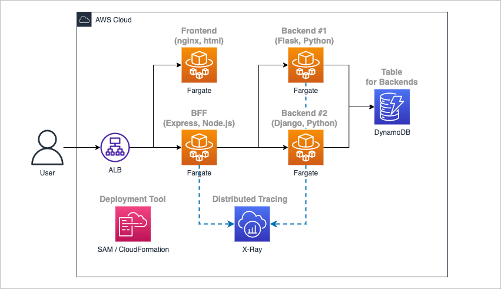
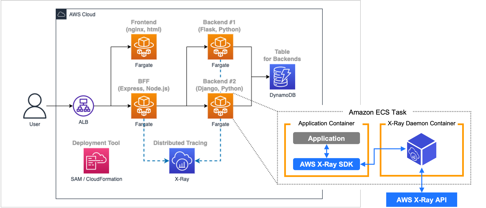
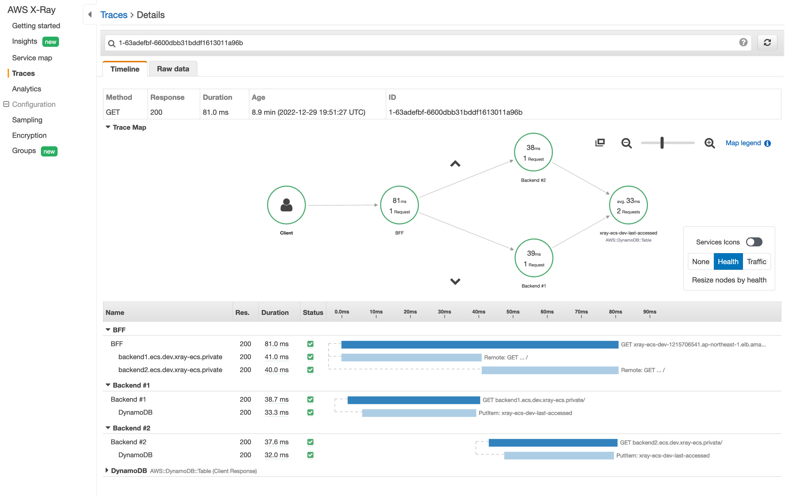
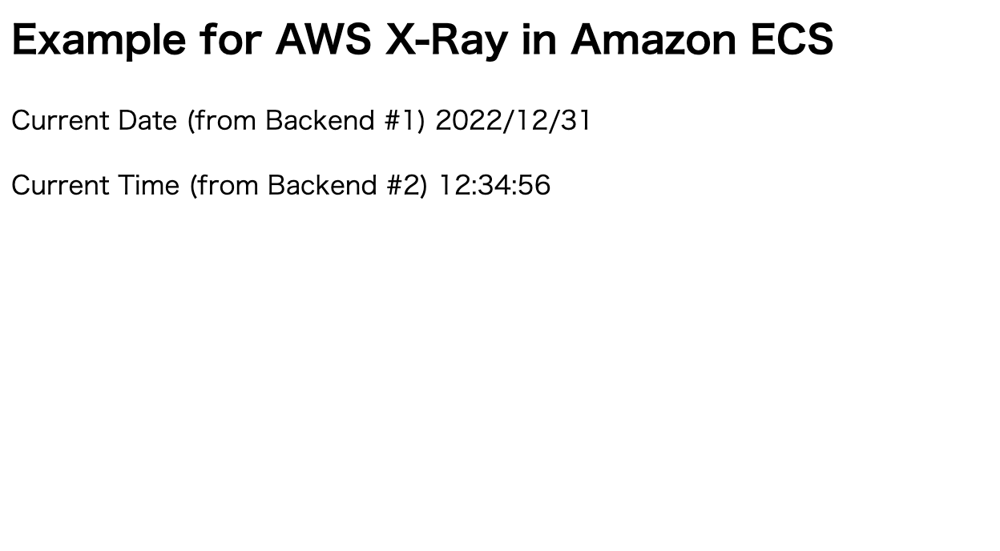

# Example for AWS X-Ray in Amazon ECS


## 1. Overview

### 1.1. Use case

- This pattern describes implementation guides and example codes for the developers who are planning to implement distributed tracing system using AWS X-Ray, under distributed architecture (i.e. Microservices architecture) that consists of multiple containers based on Amazon ECS.


### 1.2. Assumed requirements

- System adminstrators can monitor system performance and reliability across multiple containers based on Amazon ECS, and can identify the bottlenecks of them.


### 1.3. Limitations

- This pattern contains only content about _ECS on Fargate_. The contents specific to _ECS on EC2_ are not mentioned here.

- Some application codes are included as example codes, but not all the languages or frameworks supported in AWS X-Ray are described here, only for _Express framework for Node.js_, _Flask and Django framework for Python_.

- For the sake of simplicity, it has not been properly designed except for the settings mentioned in this article, such as communication encryption, capacity tuning, redundancy, etc.


### 1.4. Architecture

- The example codes assumes an architecture consisting of 4 containers based on ECS Fargate.

    1. **Frontend (nginx, html)**
        
        Returns simple html file that sends requests to BFF and displays the result.

    1. **BFF (Express, Node.js)**
        
        Requests to Backend #1, #2 sequentially and responds with the combined result in JSON format.

    1. **Backend #1 (Flask, Python)**
        
        Responds current date information in JSON format, writing log (last accessed time) to DynamoDB.

    1. **Backend #2 (Django, Python)**
        
        Responds current time information in JSON format, writing log (last accessed time) to DynamoDB.

    


### 1.5. Distributed tracing mechanism

- Trace data is obtained and associated through **BFF, Backend #1, Backend #2** using AWS X-Ray SDK and AWS X-Ray Daemon on Amazon ECS tasks.

    

    _Note: In this case, trace data of **Frontend** was excluded from the collection, because it can be obtained from developer tools of common browser._

- Trace data can be monitored on AWS X-Ray Console like below.

    


## 2. Prerequisites

### 2.1. Tools

- The following tools need to be installed on your machine.
    - [AWS CLI version 2](https://docs.aws.amazon.com/cli/latest/userguide/install-cliv2.html)
    - [AWS SAM CLI](https://docs.aws.amazon.com/serverless-application-model/latest/developerguide/install-sam-cli.html)
    - [docker](https://docs.docker.com/get-docker/)


## 3. Usage

### 3.1. Installation

1. Download source codes from this repository to your machine.

1. Edit `envs/default.conf`. You can skip this step if you proceed with default settings.

1. Run `install.sh` with the following command. This might take 15 minutes or more.

    ```bash
    $ bash scripts/install.sh
    ```

1. After installation, get the frontend endpoint URL with the following command.

    ```bash
    $ bash scripts/get_url.sh
    ```

1. Access to the URL via browser, then current date and time are shown like below.

    

1. After trying to access the URL some times, access to [X-Ray console](https://ap-northeast-1.console.aws.amazon.com/xray/home) then you can see the trace map.

    


### 3.2. Update

1. Run `install.sh` again after modifications with the following command.

    ```bash
    $ bash scripts/install.sh
    ```


### 3.3. Uninstallation

1. Run `uninstall.sh` with the following command.

    ```bash
    $ bash scripts/uninstall.sh
    ```


## 4. Implementation guide

- This pattern describes how to implement distributed tracing mechanism under the Amazon ECS container-based distributed system using AWS X-Ray.

- To obtain trace data in AWS X-Ray from Amazon ECS containers, 2 types of configurations need to be configured properly.

  1. Application codes

  1. CloudFormation templates


### 4.1. Application codes

#### 4.1.1. Add X-Ray SDK middlewares (for tracing incoming requests)

- To enable tracing incoming requests in application codes, you can add X-Ray SDK middlewares for supported framework.

- In the following sections, we share examples for Express(Node.js), Flask(Python) and Django(Python).


##### 4.1.1.1. Example for Express(Node.js): [app/bff/server.js](app/bff/server.js)

```javascript
//------------------------------------------------------------
// Add X-Ray SDK for Node.js with the middleware (Express)
// - https://docs.aws.amazon.com/xray/latest/devguide/xray-sdk-nodejs-middleware.html#xray-sdk-nodejs-middleware-express
//------------------------------------------------------------
const AWSXRay = require('aws-xray-sdk');
//------------------------------------------------------------

const express = require('express');

...

const app = express();

//------------------------------------------------------------
// Open segment for X-Ray with the middleware (Express)
// - https://docs.aws.amazon.com/xray/latest/devguide/xray-sdk-nodejs-middleware.html#xray-sdk-nodejs-middleware-express
//------------------------------------------------------------
app.use(AWSXRay.express.openSegment('BFF'));
//------------------------------------------------------------

...

//------------------------------------------------------------
// Close segment for X-Ray with the middleware (Express)
// - https://docs.aws.amazon.com/xray/latest/devguide/xray-sdk-nodejs-middleware.html#xray-sdk-nodejs-middleware-express
//------------------------------------------------------------
app.use(AWSXRay.express.closeSegment());
//------------------------------------------------------------

...
```

References:
- [Tracing incoming requests with Express](https://docs.aws.amazon.com/xray/latest/devguide/xray-sdk-nodejs-middleware.html#xray-sdk-nodejs-middleware-express)


##### 4.1.1.2. Example for Flask(Python): [app/backend1/app.py](app/backend1/app.py)

```python
from flask import *
from flask_cors import CORS
import time, datetime, os, math, logging
import boto3

...

#------------------------------------------------------------#
# Add X-Ray SDK for Python with the middleware (Flask)
# - https://docs.aws.amazon.com/xray/latest/devguide/xray-sdk-python-middleware.html#xray-sdk-python-adding-middleware-flask
#------------------------------------------------------------#
from aws_xray_sdk.core import xray_recorder
from aws_xray_sdk.ext.flask.middleware import XRayMiddleware
#------------------------------------------------------------#

...

app = Flask(__name__)
CORS(app)

#------------------------------------------------------------#
# Setup X-Ray SDK and apply patch to Flask application
# - https://docs.aws.amazon.com/xray/latest/devguide/xray-sdk-python-middleware.html#xray-sdk-python-adding-middleware-flask
#------------------------------------------------------------#
xray_recorder.configure(service='Backend #1')
XRayMiddleware(app, xray_recorder)
#------------------------------------------------------------#

...
```

References:
- [Adding the middleware to your application (flask)](https://docs.aws.amazon.com/xray/latest/devguide/xray-sdk-python-middleware.html#xray-sdk-python-adding-middleware-flask)


##### 4.1.1.3. Example for Django(Python): [app/backend2/project/project/settings.py](app/backend2/project/project/settings.py)

```python
...

#------------------------------------------------------------#
# Add X-Ray SDK for Python with the middleware (Django)
# - https://docs.aws.amazon.com/xray/latest/devguide/xray-sdk-python-middleware.html#xray-sdk-python-adding-middleware-django
#------------------------------------------------------------#
INSTALLED_APPS = [
    'aws_xray_sdk.ext.django', # Added
    'django.contrib.admin',
    'django.contrib.auth',
    'django.contrib.contenttypes',
    'django.contrib.sessions',
    'django.contrib.messages',
    'django.contrib.staticfiles',
]

MIDDLEWARE = [
    'aws_xray_sdk.ext.django.middleware.XRayMiddleware', # Added
    'django.middleware.security.SecurityMiddleware',
    'django.contrib.sessions.middleware.SessionMiddleware',
    'django.middleware.common.CommonMiddleware',
    'django.middleware.csrf.CsrfViewMiddleware',
    'django.contrib.auth.middleware.AuthenticationMiddleware',
    'django.contrib.messages.middleware.MessageMiddleware',
    'django.middleware.clickjacking.XFrameOptionsMiddleware',
]
#------------------------------------------------------------#

...

#------------------------------------------------------------#
# Recorder configuration for X-Ray
# - https://docs.aws.amazon.com/xray/latest/devguide/xray-sdk-python-configuration.html#xray-sdk-python-middleware-configuration-django
#------------------------------------------------------------#
XRAY_RECORDER = {
    'AWS_XRAY_TRACING_NAME': 'Backend #2',
    'AWS_XRAY_CONTEXT_MISSING': 'LOG_ERROR',
}
#------------------------------------------------------------#

```

References:
- [Adding the middleware to your application (Django)](https://docs.aws.amazon.com/xray/latest/devguide/xray-sdk-python-middleware.html#xray-sdk-python-adding-middleware-django)
- [Recorder configuration with Django](https://docs.aws.amazon.com/xray/latest/devguide/xray-sdk-python-configuration.html#xray-sdk-python-middleware-configuration-django)


#### 4.1.2. Apply patches to libraries (for tracing downstream calls)

- If you want to trace downstream calls from applications and associate them, you can apply patches to the supported libraries for each language.
- In the following sections, we share examples for Node.js and Python.


##### 4.1.2.1. Example for Node.js: [app/bff/server.js](app/bff/server.js)

```javascript
...

//------------------------------------------------------------
// Apply patches to Node.js libraries for tracing downstream HTTP requests
// - https://docs.aws.amazon.com/xray/latest/devguide/xray-sdk-nodejs-httpclients.html
// - https://github.com/aws-samples/aws-xray-sdk-node-sample/blob/master/index.js
//------------------------------------------------------------
// HTTP Client
AWSXRay.captureHTTPsGlobal(require('http'));
AWSXRay.capturePromise();
const axios = require('axios');

// // AWS SDK (not used in this sample)
// const AWS = AWSXRay.captureAWS(require('aws-sdk'));
//------------------------------------------------------------

...
```

References:
- [Tracing calls to downstream HTTP web services using the X-Ray SDK for Node.js](https://docs.aws.amazon.com/xray/latest/devguide/xray-sdk-nodejs-httpclients.html)
- [X-Ray SDK for Node.js Sample App](https://github.com/aws-samples/aws-xray-sdk-node-sample/tree/56edb37a5fae46c14eb74793509de3ed6e2f5c5c)


##### 4.1.2.2. Example for Python: [app/backend1/app.py](app/backend1/app.py), [app/backend2/project/api/views.py](app/backend2/project/api/views.py)

```python
...

#------------------------------------------------------------#
# Apply patches to Python libraries for tracing downstream HTTP requests
# - https://docs.aws.amazon.com/xray/latest/devguide/xray-sdk-python-patching.html
#------------------------------------------------------------#
from aws_xray_sdk.core import patch_all
patch_all()
#------------------------------------------------------------#

...
```

References:
- [Patching libraries to instrument downstream calls](https://docs.aws.amazon.com/xray/latest/devguide/xray-sdk-python-patching.html)


#### 4.1.3. Configure X-Ray segments manually

- Without using X-Ray SDK with the middleware and patches for the libraries, you can manually configure X-Ray segments and subsegments.

- It enables us to associate services and obtain trace data through the communication between them, but you need to take care header information to be set and passed.


##### 4.1.3.1. Example for Python in BFF

```python
from flask import *
import time, datetime, os, math, logging
import boto3

#------------------------------------------------------------#
# Add X-Ray SDK for Python
# - https://docs.aws.amazon.com/xray/latest/devguide/xray-sdk-python-middleware.html#xray-sdk-python-middleware-manual
#------------------------------------------------------------#
from aws_xray_sdk.core import xray_recorder
#------------------------------------------------------------#

app = Flask(__name__)


@app.route('/health', methods=['GET'])
def health_check():
    return jsonify({
        "status": "ok"
    })


@app.route("/", methods=["GET"])
def main():

    #--------------------------------------------------------#
    # Get trace_id and parent_id from headers
    # - https://docs.aws.amazon.com/xray/latest/devguide/xray-services-elb.html
    #--------------------------------------------------------#
    trace_id = request.headers.get('X_RAY_HEADER_TRACE')
    parent_id = request.headers.get('X_RAY_HEADER_PARENT')
    #--------------------------------------------------------#

    #--------------------------------------------------------#
    # Begin "segment"
    # - https://docs.aws.amazon.com/xray/latest/devguide/xray-sdk-python-middleware.html#xray-sdk-python-middleware-manual
    #--------------------------------------------------------#
    xray_recorder.begin_segment(name='Backend #1', parent_id=parent_id ,traceid=trace_id)
    #--------------------------------------------------------#

    #--------------------------------------------------------#
    # Create new headers using current segment information
    # - https://docs.aws.amazon.com/xray-sdk-for-python/latest/reference/basic.html
    #--------------------------------------------------------#
    current_segment = xray_recorder.current_segment()
    headers  = {
        'X_RAY_HEADER_TRACE': current_segment.trace_id,
        'X_RAY_HEADER_PARENT': current_segment.id
    }
    #--------------------------------------------------------#

    #----------------------------------------------------#
    # Begin "subsegment" #1
    # - https://docs.aws.amazon.com/xray/latest/devguide/xray-sdk-python-subsegments.html
    #----------------------------------------------------#
    xray_recorder.begin_subsegment(name='Call Backend #1')
    #----------------------------------------------------#

    # Write to DynamoDB table
    dyname_db_table_name = os.environ.get('DYNAMO_DB_TABLE_NAME', '')
    region_name = os.environ.get('AWS_DEFAULT_REGION', '')
    try:
        dynamodb = boto3.resource('dynamodb', region_name=region_name)
        table = dynamodb.Table(dyname_db_table_name)
        table.put_item(Item={
            "SubAppId": "backend1",
            "LastAccessed": str(math.floor(time.time()))
        })
    except Exception as e:
        logger.exception(e)

    #----------------------------------------------------#
    # End "subsegment" #1
    # - https://docs.aws.amazon.com/xray/latest/devguide/xray-sdk-python-subsegments.html
    #----------------------------------------------------#
    xray_recorder.end_subsegment()
    #----------------------------------------------------#

    #----------------------------------------------------#
    # Begin "subsegment" #2
    # - https://docs.aws.amazon.com/xray/latest/devguide/xray-sdk-python-subsegments.html
    #----------------------------------------------------#
    xray_recorder.begin_subsegment(name='Call Backend #2')
    #----------------------------------------------------#

    #----------------------------------------------------#
    # End "subsegment" #2
    # - https://docs.aws.amazon.com/xray/latest/devguide/xray-sdk-python-subsegments.html
    #----------------------------------------------------#
    xray_recorder.end_subsegment()
    #----------------------------------------------------#

    #--------------------------------------------------------#
    # End "segment"
    # - https://docs.aws.amazon.com/xray/latest/devguide/xray-sdk-python-middleware.html#xray-sdk-python-middleware-manual
    #--------------------------------------------------------#
    xray_recorder.end_segment()
    #--------------------------------------------------------#

    # Return current date
    current_datetime = datetime.datetime.fromtimestamp(time.time()).astimezone(datetime.timezone(datetime.timedelta(hours=9)))
    return jsonify({
        "currentDate": current_datetime.strftime('%Y/%m/%d')
    })


if __name__ == '__main__':
    app.run(host="0.0.0.0", port=80)
```

References:
- [Instrumenting Python code manually](https://docs.aws.amazon.com/xray/latest/devguide/xray-sdk-python-middleware.html#xray-sdk-python-middleware-manual)
- [Generating custom subsegments with the X-Ray SDK for Python](https://docs.aws.amazon.com/xray/latest/devguide/xray-sdk-python-subsegments.html)
- [aws-xray-sdk - Basic Usage](https://docs.aws.amazon.com/xray-sdk-for-python/latest/reference/basic.html)
- [Elastic Load Balancing and AWS X-Ray](https://docs.aws.amazon.com/xray/latest/devguide/xray-services-elb.html)


### 4.2. CloudFormation templates

#### 4.2.1. Add X-Ray daemon container settings to ECS task definition

- X-Ray daemon container settings are needed in ECS task definition.
- About X-Ray daemon container, please see section 1.5.

##### 4.2.1.1. Example for CFn template: [templates/2-svc-bff.yml](templates/2-svc-bff.yml)

```yaml
  BffEcsTaskDefinition:
    Type: AWS::ECS::TaskDefinition
    Properties:
      ContainerDefinitions:
        - Name: "bff-app"
...
        #------------------------------------------------------------#
        # X-Ray daemon container (side-car) definition for ECS Task
        # - https://docs.aws.amazon.com/xray/latest/devguide/xray-daemon-ecs.html
        # - https://gallery.ecr.aws/xray/aws-xray-daemon
        #------------------------------------------------------------#
        - Name: "bff-xray-daemon"
          Image: public.ecr.aws/xray/aws-xray-daemon
          PortMappings:
            - ContainerPort: 2000
              Protocol: udp
          LogConfiguration:
            LogDriver: awslogs
            Options:
              awslogs-create-group: True
              awslogs-group: {"Fn::ImportValue": !Sub "${AppId}-${EnvId}-ecs-log-group-name"}
              awslogs-region: !Ref AWS::Region
              awslogs-stream-prefix: bff
        #------------------------------------------------------------#
...
      TaskRoleArn: !GetAtt EcsTaskRole.Arn

```

References:
- [Running the X-Ray daemon on Amazon ECS](https://docs.aws.amazon.com/xray/latest/devguide/xray-daemon-ecs.html)
- [Amazon ECR Public Gallery > xray > xray/aws-xray-daemon](https://gallery.ecr.aws/xray/aws-xray-daemon)


#### 4.2.2. Add a policy to ECS task role

- A policy is needed in ECS task role for writing data into X-Ray through the X-Ray daemon container.

##### 4.2.2.1. Example for CFn template: [templates/1-svc-base.yml](templates/1-svc-base.yml)

```yaml
  EcsTaskRole:
    Type: AWS::IAM::Role
    Properties:
...
      ManagedPolicyArns:
        #------------------------------------------------------------#
        # Required role for X-Ray daemon container in ECS Task
        # - https://docs.aws.amazon.com/ja_jp/xray/latest/devguide/security_iam_id-based-policy-examples.html
        #------------------------------------------------------------#
        - arn:aws:iam::aws:policy/AWSXRayDaemonWriteAccess
        #------------------------------------------------------------#
...
```

References:
- [AWS X-Ray identity-based policy examples](https://docs.aws.amazon.com/xray/latest/devguide/security_iam_id-based-policy-examples.html)


#### 4.2.3. Configure X-Ray Sampling Rule

- In X-Ray, sampling rules can be adjusted mainly for the cost perspectives.
- In this case we add a sampling rule to disable sampling healthcheck traffic in each service using CloudFormation.


##### 4.2.3.1. Example for CFn template: [templates/1-svc-base.yml](templates/1-svc-base.yml)

```yaml
  #------------------------------------------------------------#
  # X-Ray Sampling rules to disable sampling healthcheck traffic
  # - https://docs.aws.amazon.com/xray/latest/devguide/xray-console-sampling.html#xray-console-sampling-options
  #------------------------------------------------------------#
  XRaySamplingRule:
    Type: AWS::XRay::SamplingRule
    Properties:
      SamplingRule:
        Version: 1
        RuleName: !Sub "ignore-healthcheck"
        Priority: 1
        ReservoirSize: 0
        FixedRate: 0
        ServiceName: "*"
        ServiceType: "*"
        HTTPMethod: "GET"
        URLPath: "/health"
        ResourceARN: "*"
        Host: "*"
  #------------------------------------------------------------#
```

References:
- [Sampling rule options](https://docs.aws.amazon.com/xray/latest/devguide/xray-console-sampling.html#xray-console-sampling-options)


## 5. Security

See [CONTRIBUTING](CONTRIBUTING.md#security-issue-notifications) for more information.


## 6. License

This library is licensed under the MIT-0 License. See the LICENSE file.

